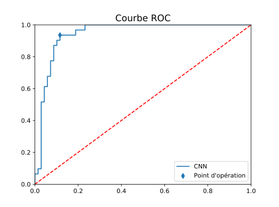

# propreté

Séparations d'images propres et sales issues d'un examen de l'intestin grêle par une pilule Pillcam© à l'aide d'un réseau de neurones convolutif reposant sur Keras.


Structure du dossier attendue pour faire fonctionner le programme actuel :

```
proprete
│
├── modele_grele.py
├── Verite_Terrain.xls
└── images_intestins
    ├── expert1.png
    ├── expert2.png
    │   ...
    └── expert600.png
```

En entraînant le réseau sur 500 images et en le testant sur les 100 restantes, nous avons obtenu une précision de 99.4% sur l'ensemble d'entraînement, et de 93% sur l'ensemble de test.

Architecture du réseau :
```
____________________________________________________________________________________________________
Layer (type)                                 Output Shape                            Param #        
====================================================================================================
conv2d_20 (Conv2D)                           (None, 146, 146, 32)                    2432           
____________________________________________________________________________________________________
max_pooling2d_12 (MaxPooling2D)              (None, 73, 73, 32)                      0              
____________________________________________________________________________________________________
conv2d_21 (Conv2D)                           (None, 71, 71, 64)                      18496          
____________________________________________________________________________________________________
max_pooling2d_13 (MaxPooling2D)              (None, 35, 35, 64)                      0              
____________________________________________________________________________________________________
conv2d_22 (Conv2D)                           (None, 33, 33, 64)                      36928          
____________________________________________________________________________________________________
max_pooling2d_14 (MaxPooling2D)              (None, 16, 16, 64)                      0              
____________________________________________________________________________________________________
conv2d_23 (Conv2D)                           (None, 14, 14, 196)                     113092         
____________________________________________________________________________________________________
max_pooling2d_15 (MaxPooling2D)              (None, 7, 7, 196)                       0              
____________________________________________________________________________________________________
conv2d_24 (Conv2D)                           (None, 5, 5, 256)                       451840         
____________________________________________________________________________________________________
max_pooling2d_16 (MaxPooling2D)              (None, 2, 2, 256)                       0              
____________________________________________________________________________________________________
flatten_4 (Flatten)                          (None, 1024)                            0              
____________________________________________________________________________________________________
dense_10 (Dense)                             (None, 256)                             262400         
____________________________________________________________________________________________________
dropout_7 (Dropout)                          (None, 256)                             0              
____________________________________________________________________________________________________
dense_11 (Dense)                             (None, 64)                              16448          
____________________________________________________________________________________________________
dropout_8 (Dropout)                          (None, 64)                              0              
____________________________________________________________________________________________________
dense_12 (Dense)                             (None, 1)                               65             
====================================================================================================
Total params: 901,701
Trainable params: 901,701
Non-trainable params: 0
____________________________________________________________________________________________________
```

Résultats actuels :
Sensibilité : 93.55%
Spécificité : 88.41%

Courbe ROC :

